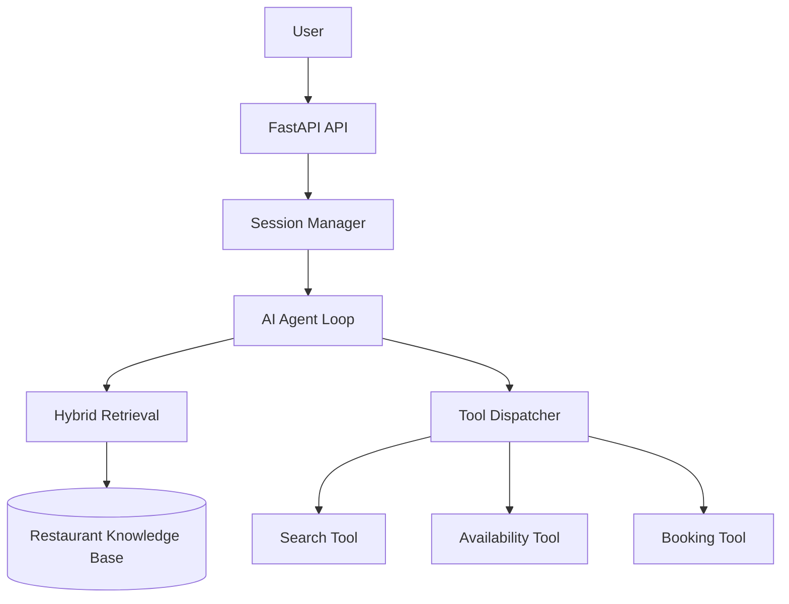

# Service Agent Platform

Service Agent Platform is a lightweight AI application for service businesses.

The first implementation focuses on restaurant reservations. It allows users to ask questions about the restaurant, check table availability, and make reservations through natural conversation.

Rather than building a feature-heavy application, this project focuses on a clean architecture that combines retrieval, tool calling, session memory, and deterministic business logic into a simple and maintainable system.

---

## Features

- Hybrid Retrieval (Keyword Search + Vector Search + Reciprocal Rank Fusion)
- Retrieval-Augmented Generation (RAG)
- OpenAI tool calling
- Restaurant knowledge base
- Table availability checking
- Reservation creation
- Multi-turn conversations with session memory
- Automatic slot extraction from natural language
- Evaluation pipeline
- Runtime monitoring with latency logging
- Automated test suite

---

## Architecture



Layered view:

```text
User Interface
  ↓
FastAPI API
  ↓
Session Layer
  ↓
Agent Layer
  ↓
Retrieval + Tool Layer
  ↓
Deterministic Business Logic
  ↓
Knowledge Base / Runtime Storage
```

The language model is responsible for reasoning and deciding **when** to use a tool.

Python is responsible for deterministic business logic such as retrieval, availability checks, reservation creation, and session management.

> **LLM thinks. Python executes.**

---

## Project Structure

```text
app/
├── agent/         AI agent loop, dispatcher and tool registry
├── monitoring/    Runtime logging
├── rag/           Hybrid retrieval pipeline
├── session/       Session management and slot extraction
├── tools/         Restaurant business logic
└── main.py        FastAPI application

data/
└── restaurant/
    └── knowledge_base.md

evaluations/       Evaluation runner and test cases
scripts/           Utility scripts
tests/             Automated tests
```

---

## Getting Started

### Install dependencies

```bash
uv sync
```

### Create a `.env` file

```text
OPENAI_API_KEY=your_api_key
```

### Download the embedding model

```bash
uv run python scripts/download_embedder.py
```

### Start the application

```bash
uv run uvicorn app.main:app --reload
```

The API will be available at:

```text
http://127.0.0.1:8000
```

---

## Quick Demo

Ask a question about the restaurant:

```bash
curl -X POST http://127.0.0.1:8000/chat \
  -H "Content-Type: application/json" \
  -d '{"message":"Do you have vegan options?"}'
```

Start a reservation:

```bash
curl -X POST http://127.0.0.1:8000/chat \
  -H "Content-Type: application/json" \
  -d '{"message":"I want to book a table for four people."}'
```

Continue the conversation using the returned `session_id`:

```bash
curl -X POST http://127.0.0.1:8000/chat \
  -H "Content-Type: application/json" \
  -d '{"session_id":"<SESSION_ID>","message":"2026-07-03 at 19:30. My name is John Doe and my phone number is +41000000000."}'
```

---

## Evaluation

Run the evaluation suite:

```bash
uv run python -m evaluations.run_evaluation
```

Current results:

- 6 scenarios
- 6 passed
- 100% accuracy

---

## Testing

Run the test suite:

```bash
uv run pytest
```

Current status:

- 14 tests
- 14 passing

---

## Monitoring

Every conversation is logged during runtime.

Each log entry contains:

- Session ID
- User message
- Assistant response
- Response latency
- Timestamp

Runtime files are excluded from version control.

---

## Design Principles

This project follows a few simple principles:

- Keep the architecture modular and easy to understand.
- Let the LLM handle reasoning, not business logic.
- Keep business rules deterministic and testable.
- Prefer simple solutions over unnecessary complexity.
- Build reusable components that can be adapted to other service domains.

Although the first implementation targets restaurant reservations, the same architecture can be extended to other service businesses such as hotels, clinics, salons, and customer support systems.
